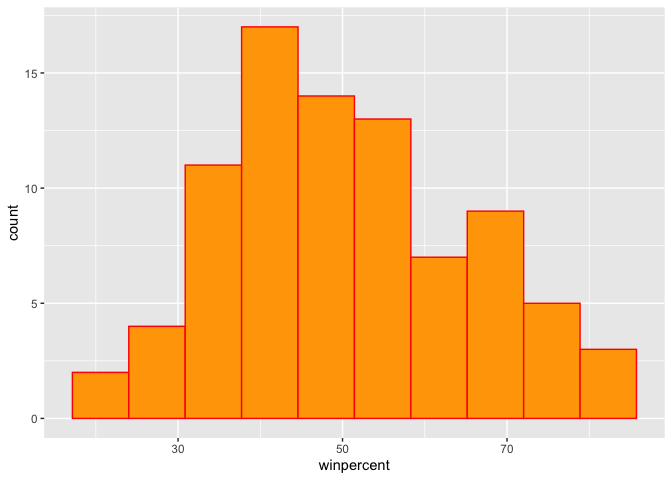
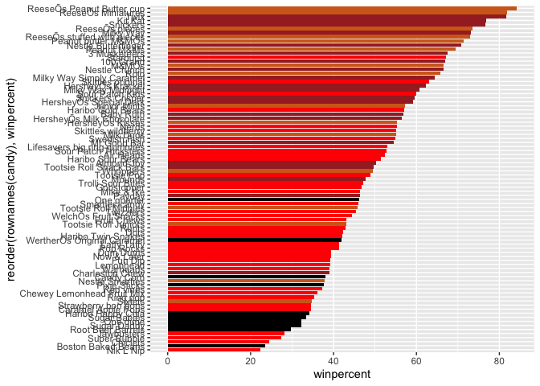
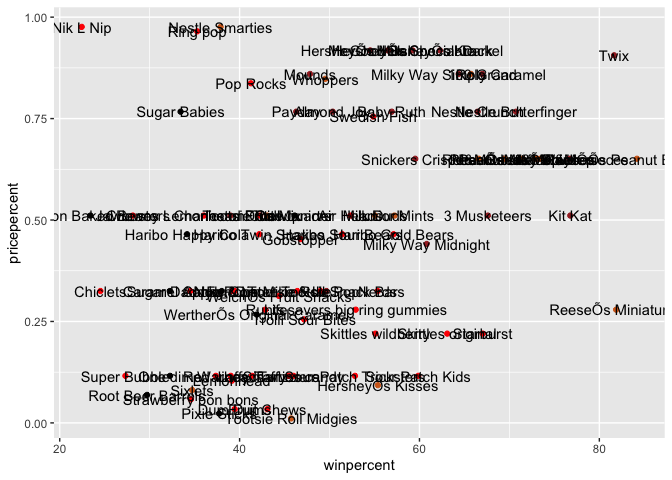
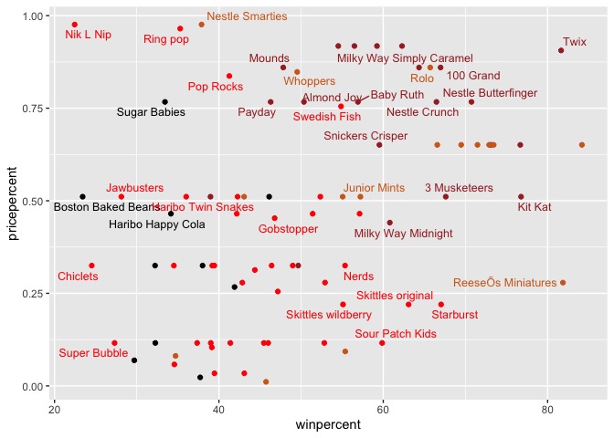
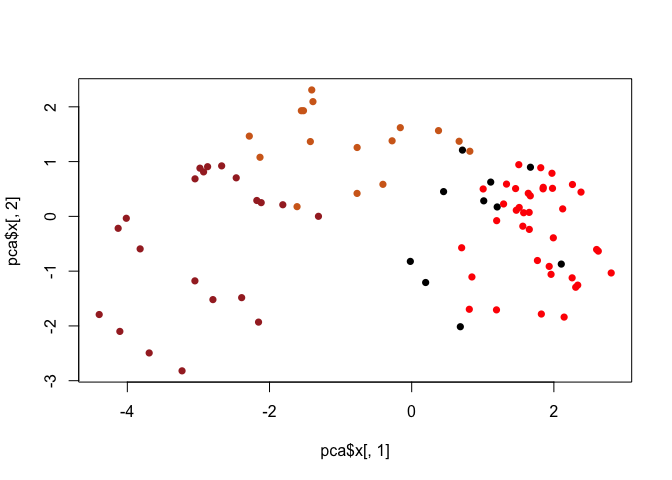
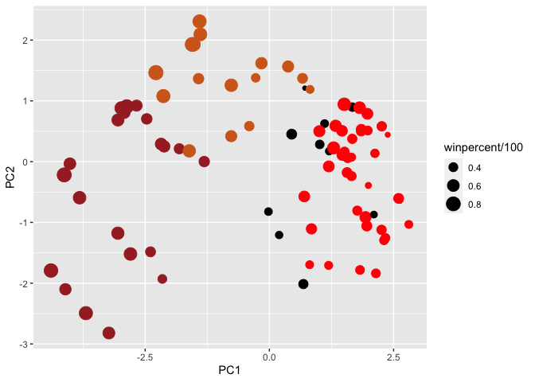
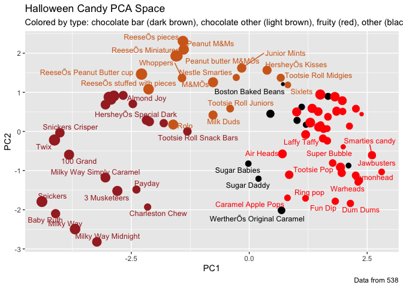
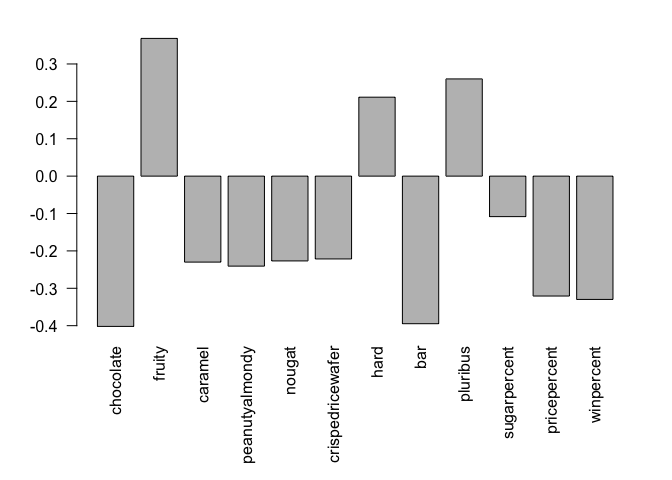
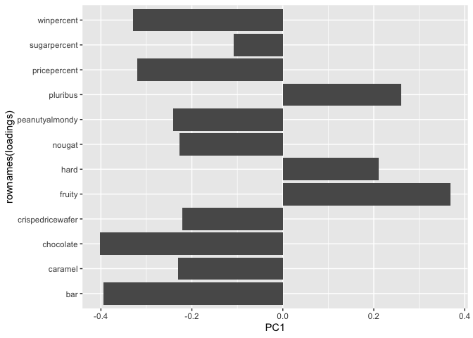

Class 10: Haloween Candy Mini Project
================
Barry

## Background

Here we explore 538 Haloween candy data. They recently ran a rather
large poll to determine which candy their readers like best. From their
website: “While we don’t know who exactly voted, we do know this: 8,371
different IP addresses voted on about 269,000 randomly generated candy
matchups”.

Let’s get the data. I will download to my project directory…

``` r
candy <- read.csv("candy-data.csv", row.names = 1)
head(candy)
```

                 chocolate fruity caramel peanutyalmondy nougat crispedricewafer
    100 Grand            1      0       1              0      0                1
    3 Musketeers         1      0       0              0      1                0
    One dime             0      0       0              0      0                0
    One quarter          0      0       0              0      0                0
    Air Heads            0      1       0              0      0                0
    Almond Joy           1      0       0              1      0                0
                 hard bar pluribus sugarpercent pricepercent winpercent
    100 Grand       0   1        0        0.732        0.860   66.97173
    3 Musketeers    0   1        0        0.604        0.511   67.60294
    One dime        0   0        0        0.011        0.116   32.26109
    One quarter     0   0        0        0.011        0.511   46.11650
    Air Heads       0   0        0        0.906        0.511   52.34146
    Almond Joy      0   1        0        0.465        0.767   50.34755

> Q1. How many different candy types are in this dataset?

``` r
nrow(candy)
```

    [1] 85

> Q2. How many fruity candy types are in the dataset?

``` r
sum(candy$fruity)
```

    [1] 38

## Winpercent

The most interesting variables in the dataset is `winpercent`. For a
given candy this value is the percentage of people who prefer this candy
over another randomly chosen candy

> Q3. What is your favorite candy in the dataset and what is it’s
> winpercent value?

``` r
rownames(candy)
```

     [1] "100 Grand"                   "3 Musketeers"               
     [3] "One dime"                    "One quarter"                
     [5] "Air Heads"                   "Almond Joy"                 
     [7] "Baby Ruth"                   "Boston Baked Beans"         
     [9] "Candy Corn"                  "Caramel Apple Pops"         
    [11] "Charleston Chew"             "Chewey Lemonhead Fruit Mix" 
    [13] "Chiclets"                    "Dots"                       
    [15] "Dum Dums"                    "Fruit Chews"                
    [17] "Fun Dip"                     "Gobstopper"                 
    [19] "Haribo Gold Bears"           "Haribo Happy Cola"          
    [21] "Haribo Sour Bears"           "Haribo Twin Snakes"         
    [23] "HersheyÕs Kisses"            "HersheyÕs Krackel"          
    [25] "HersheyÕs Milk Chocolate"    "HersheyÕs Special Dark"     
    [27] "Jawbusters"                  "Junior Mints"               
    [29] "Kit Kat"                     "Laffy Taffy"                
    [31] "Lemonhead"                   "Lifesavers big ring gummies"
    [33] "Peanut butter M&MÕs"         "M&MÕs"                      
    [35] "Mike & Ike"                  "Milk Duds"                  
    [37] "Milky Way"                   "Milky Way Midnight"         
    [39] "Milky Way Simply Caramel"    "Mounds"                     
    [41] "Mr Good Bar"                 "Nerds"                      
    [43] "Nestle Butterfinger"         "Nestle Crunch"              
    [45] "Nik L Nip"                   "Now & Later"                
    [47] "Payday"                      "Peanut M&Ms"                
    [49] "Pixie Sticks"                "Pop Rocks"                  
    [51] "Red vines"                   "ReeseÕs Miniatures"         
    [53] "ReeseÕs Peanut Butter cup"   "ReeseÕs pieces"             
    [55] "ReeseÕs stuffed with pieces" "Ring pop"                   
    [57] "Rolo"                        "Root Beer Barrels"          
    [59] "Runts"                       "Sixlets"                    
    [61] "Skittles original"           "Skittles wildberry"         
    [63] "Nestle Smarties"             "Smarties candy"             
    [65] "Snickers"                    "Snickers Crisper"           
    [67] "Sour Patch Kids"             "Sour Patch Tricksters"      
    [69] "Starburst"                   "Strawberry bon bons"        
    [71] "Sugar Babies"                "Sugar Daddy"                
    [73] "Super Bubble"                "Swedish Fish"               
    [75] "Tootsie Pop"                 "Tootsie Roll Juniors"       
    [77] "Tootsie Roll Midgies"        "Tootsie Roll Snack Bars"    
    [79] "Trolli Sour Bites"           "Twix"                       
    [81] "Twizzlers"                   "Warheads"                   
    [83] "WelchÕs Fruit Snacks"        "WertherÕs Original Caramel" 
    [85] "Whoppers"                   

``` r
candy["Milky Way",]$winpercent
```

    [1] 73.09956

``` r
candy["Caramel Apple Pops",]
```

                       chocolate fruity caramel peanutyalmondy nougat
    Caramel Apple Pops         0      1       1              0      0
                       crispedricewafer hard bar pluribus sugarpercent pricepercent
    Caramel Apple Pops                0    0   0        0        0.604        0.325
                       winpercent
    Caramel Apple Pops   34.51768

> Q4. What is the winpercent value for “Kit Kat”?

``` r
candy["Kit Kat",]$winpercent
```

    [1] 76.7686

> Q5. What is the winpercent value for “Tootsie Roll Snack Bars”?

``` r
candy["Tootsie Roll Snack Bars",]$winpercent
```

    [1] 49.6535

## A useful function from the skimr package

``` r
skimr::skim(candy)
```

|                                                  |       |
|:-------------------------------------------------|:------|
| Name                                             | candy |
| Number of rows                                   | 85    |
| Number of columns                                | 12    |
| \_\_\_\_\_\_\_\_\_\_\_\_\_\_\_\_\_\_\_\_\_\_\_   |       |
| Column type frequency:                           |       |
| numeric                                          | 12    |
| \_\_\_\_\_\_\_\_\_\_\_\_\_\_\_\_\_\_\_\_\_\_\_\_ |       |
| Group variables                                  | None  |

Data summary

**Variable type: numeric**

| skim_variable    | n_missing | complete_rate |  mean |    sd |    p0 |   p25 |   p50 |   p75 |  p100 | hist  |
|:-----------------|----------:|--------------:|------:|------:|------:|------:|------:|------:|------:|:------|
| chocolate        |         0 |             1 |  0.44 |  0.50 |  0.00 |  0.00 |  0.00 |  1.00 |  1.00 | ▇▁▁▁▆ |
| fruity           |         0 |             1 |  0.45 |  0.50 |  0.00 |  0.00 |  0.00 |  1.00 |  1.00 | ▇▁▁▁▆ |
| caramel          |         0 |             1 |  0.16 |  0.37 |  0.00 |  0.00 |  0.00 |  0.00 |  1.00 | ▇▁▁▁▂ |
| peanutyalmondy   |         0 |             1 |  0.16 |  0.37 |  0.00 |  0.00 |  0.00 |  0.00 |  1.00 | ▇▁▁▁▂ |
| nougat           |         0 |             1 |  0.08 |  0.28 |  0.00 |  0.00 |  0.00 |  0.00 |  1.00 | ▇▁▁▁▁ |
| crispedricewafer |         0 |             1 |  0.08 |  0.28 |  0.00 |  0.00 |  0.00 |  0.00 |  1.00 | ▇▁▁▁▁ |
| hard             |         0 |             1 |  0.18 |  0.38 |  0.00 |  0.00 |  0.00 |  0.00 |  1.00 | ▇▁▁▁▂ |
| bar              |         0 |             1 |  0.25 |  0.43 |  0.00 |  0.00 |  0.00 |  0.00 |  1.00 | ▇▁▁▁▂ |
| pluribus         |         0 |             1 |  0.52 |  0.50 |  0.00 |  0.00 |  1.00 |  1.00 |  1.00 | ▇▁▁▁▇ |
| sugarpercent     |         0 |             1 |  0.48 |  0.28 |  0.01 |  0.22 |  0.47 |  0.73 |  0.99 | ▇▇▇▇▆ |
| pricepercent     |         0 |             1 |  0.47 |  0.29 |  0.01 |  0.26 |  0.47 |  0.65 |  0.98 | ▇▇▇▇▆ |
| winpercent       |         0 |             1 | 50.32 | 14.71 | 22.45 | 39.14 | 47.83 | 59.86 | 84.18 | ▃▇▆▅▂ |

> Q8. Plot a histogram of winpercent values

``` r
hist(candy$winpercent)
```


``` r
library(ggplot2)

ggplot(candy) +
  aes(winpercent) +
  geom_histogram(bins=10, col="red", fill="orange")
```



> Q11. On average is chocolate candy higher or lower ranked than fruit
> candy?

``` r
chocolate.inds <- as.logical(candy$chocolate)
chocolate.wins <-  candy[chocolate.inds,]$winpercent
mean(chocolate.wins)
```

    [1] 60.92153

``` r
fruit.inds <- as.logical(candy$fruity)
fruit.wins <- candy[fruit.inds,]$winpercent
mean(fruit.wins)
```

    [1] 44.11974

> Q12. Is this difference statistically significant?

``` r
t.test(chocolate.wins, fruit.wins)
```


        Welch Two Sample t-test

    data:  chocolate.wins and fruit.wins
    t = 6.2582, df = 68.882, p-value = 2.871e-08
    alternative hypothesis: true difference in means is not equal to 0
    95 percent confidence interval:
     11.44563 22.15795
    sample estimates:
    mean of x mean of y 
     60.92153  44.11974 

# 3. Candy Ranking

First setup some colors for different candy types

``` r
my_cols=rep("black", nrow(candy))
my_cols[as.logical(candy$chocolate)] = "chocolate"
my_cols[as.logical(candy$bar)] = "brown"
my_cols[as.logical(candy$fruity)] = "red"
#my_cols
```

``` r
ggplot(candy) + 
  aes(winpercent, reorder(rownames(candy),winpercent)) +
  geom_col(fill=my_cols) 
```



``` r
ggsave("tmp.png")
```

    Saving 7 x 5 in image

Now, for the first time, using this plot we can answer questions like:
\> Q17. What is the worst ranked chocolate candy? \> Q18. What is the
best ranked fruity candy?

## 4. Taking a look at pricepercent

What is the best (most liked in terms of `winpercent`) for the money (in
terms of `pricepercent`)?

To answer this I will make a plot of winpercent vs pricepercent

``` r
ggplot(candy) +
  aes(winpercent, pricepercent, label=rownames(candy)) +
  geom_point(col=my_cols) +
  geom_text()
```



The labels on this plot are too squished and overlapping. I am going to
turn to the ggrepl package and the `geom_text_repel()` function to help
avoid overlapping labels.

``` r
library(ggrepel)

ggplot(candy) +
  aes(winpercent, pricepercent, label=rownames(candy)) +
  geom_point(col=my_cols) + 
  geom_text_repel(col=my_cols, size=3.3, max.overlaps = 5)
```

    Warning: ggrepel: 50 unlabeled data points (too many overlaps). Consider
    increasing max.overlaps



6.  Principal Component Analysis

Let’s do PCA on this dataset to get a low dimensional view that
hopefully captures the essential essence of the data.

We will use the `prcomp()` function and set `scale=TRUE` because the
`winpercent` and `pricepercent` values are on a different scale!

``` r
pca <- prcomp(candy, scale=TRUE)
summary(pca)
```

    Importance of components:
                              PC1    PC2    PC3     PC4    PC5     PC6     PC7
    Standard deviation     2.0788 1.1378 1.1092 1.07533 0.9518 0.81923 0.81530
    Proportion of Variance 0.3601 0.1079 0.1025 0.09636 0.0755 0.05593 0.05539
    Cumulative Proportion  0.3601 0.4680 0.5705 0.66688 0.7424 0.79830 0.85369
                               PC8     PC9    PC10    PC11    PC12
    Standard deviation     0.74530 0.67824 0.62349 0.43974 0.39760
    Proportion of Variance 0.04629 0.03833 0.03239 0.01611 0.01317
    Cumulative Proportion  0.89998 0.93832 0.97071 0.98683 1.00000

``` r
plot(pca$x[,1], pca$x[,2], col=my_cols, pch=16)
```



And a ggplot version

``` r
# Make a new data-frame with our PCA results and candy data
my_data <- cbind(candy, pca$x[,1:3])


p <- ggplot(my_data) + 
        aes(x=PC1, y=PC2, 
            size=winpercent/100,  
            text=rownames(my_data),
            label=rownames(my_data)) +
        geom_point(col=my_cols)
p
```



``` r
library(ggrepel)

p + geom_text_repel(size=3.3, col=my_cols, max.overlaps = 7)  + 
  theme(legend.position = "none") +
  labs(title="Halloween Candy PCA Space",
       subtitle="Colored by type: chocolate bar (dark brown), chocolate other (light brown), fruity (red), other (black)",
       caption="Data from 538")
```

    Warning: ggrepel: 39 unlabeled data points (too many overlaps). Consider
    increasing max.overlaps



And the loadings that live in the `$rotation` component of our PCA
results

``` r
par(mar=c(8,4,2,2))
barplot(pca$rotation[,1], las=2)
```



``` r
loadings <- as.data.frame(pca$rotation)

ggplot(loadings) +
  aes(PC1, rownames(loadings)) +
  geom_col()
```


